# Project 1: Web Application Vulnerability Assessment and Exploitation - OWASP Juice Shop

**Objective:** To conduct an authenticated vulnerability scan of the OWASP Juice Shop application using OWASP ZAP, analyze the generated report, and successfully exploit an identified Open Redirect vulnerability.

**Skills Demonstrated:**

* Web Application Security Testing
* Authenticated Scanning Techniques
* Vulnerability Identification and Analysis (Open Redirect)
* Web Proxy Configuration and Usage
* Payload Crafting and Bypass Techniques
* HTTP Protocol Analysis
* Reporting and Documentation

**Tools Used:**

* **OWASP ZAP:** For automated vulnerability scanning and traffic interception.
* **Docker:** For deploying and managing the vulnerable Juice Shop application.
* **Kali Linux:** The operating system environment for all testing.
* **Firefox Developer Tools:** For client-side analysis and code inspection.
* **Flameshot:** For capturing high-quality screenshots throughout the project.
* **CherryTree:** For organizing notes, steps, and observations during the assessment.

---

## Juice-Shop Authenticated Scan

### Environment Setup:
I initiated the OWASP Juice Shop application within a Docker container on my Kali Linux machine. This provided a controlled and isolated environment for testing.

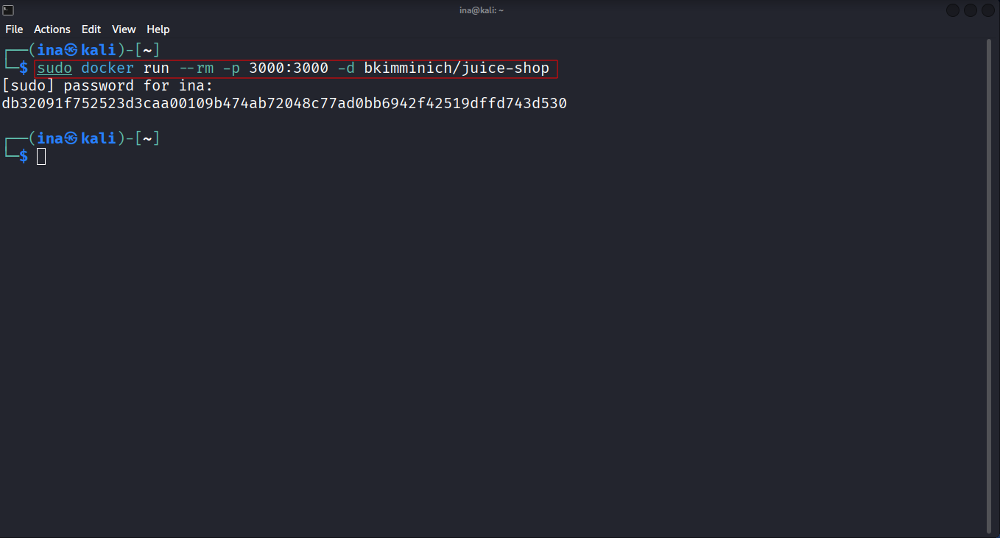

### ZAP Proxy Configuration:
I launched OWASP ZAP and configured it to intercept traffic from the Juice Shop application. I used the "Manual Explore" option, providing the Juice Shop's URL to begin the proxying process.

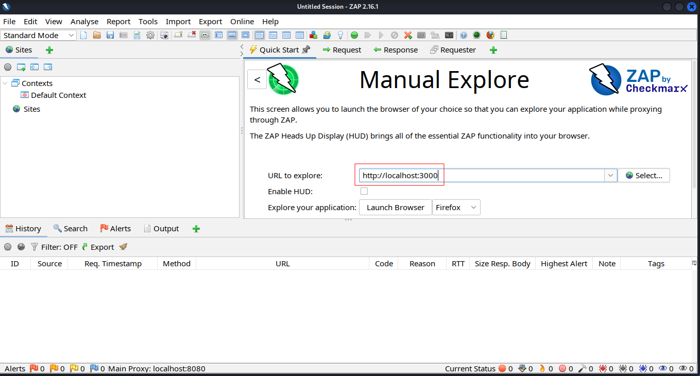

### Authenticated Session Establishment:
To perform an authenticated scan, I accessed the Juice Shop through ZAP's integrated browser (Firefox). I then logged in using legitimate administrator credentials. This step was crucial as it allowed ZAP to discover and test functionalities accessible only to authenticated users, providing a more comprehensive security assessment.

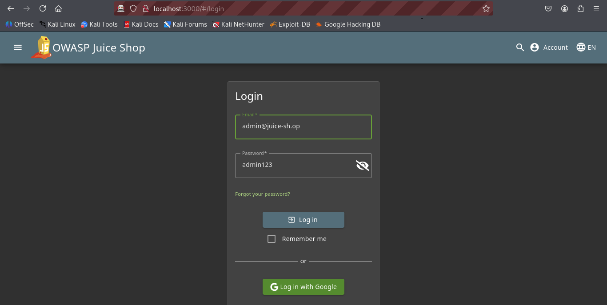

### Context and Authentication Configuration:
Within ZAP, I created a new context specifically for the Juice Shop application. I configured its authentication method as "JSON-based Authentication," aligning with the application's login mechanism. This ensures that ZAP correctly handles session management during automated scans.

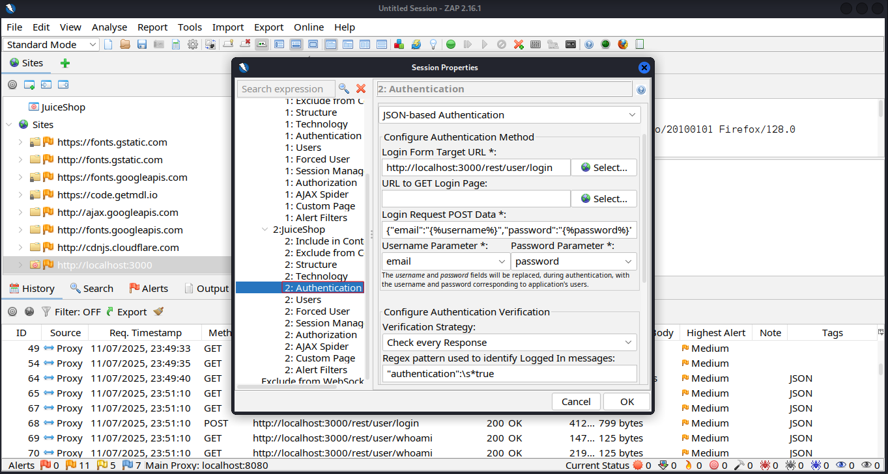

### User Configuration:
I defined the authenticated user within ZAP's "Users" settings. 

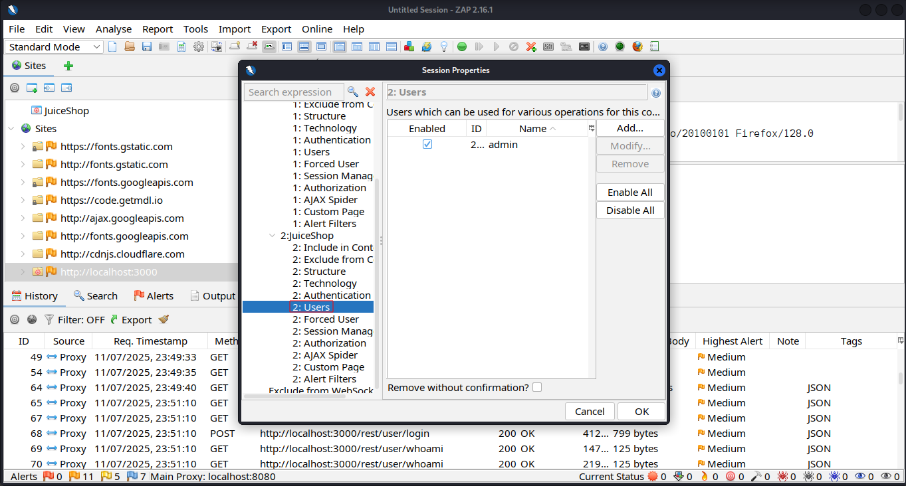

### Forced User Mode:
I enabled "Forced User Mode," which instructs ZAP to perform all subsequent scans and requests as this authenticated user, mimicking a real attacker with valid credentials.

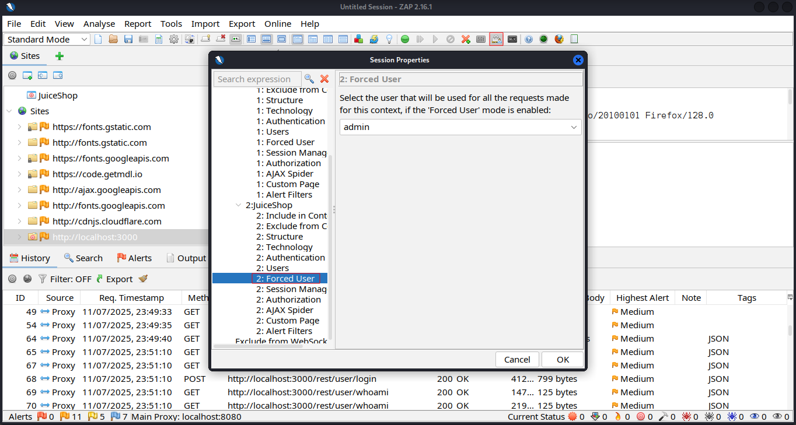

### Automated Scanning:
With the authenticated session established, I initiated a series of automated scans:
* **Spider:** This crawled the application to discover all accessible URLs and resources.
* **Ajax Spider:** This specifically targets AJAX-heavy applications to uncover dynamically loaded content and links often missed by traditional spiders.
* **Active Scan:** This actively attacked the discovered endpoints with various payloads to identify vulnerabilities.

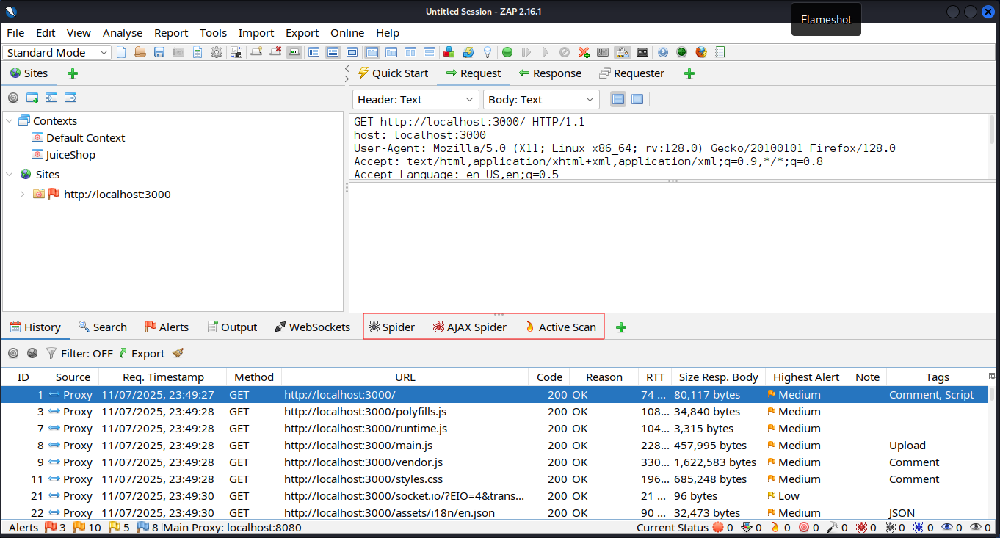

### Report Generation:
Upon completion of the scans, I generated a concise HTML/pdf report from ZAP. This report provided a summary of identified alerts and detailed findings, which served as the basis for selecting a vulnerability to exploit.

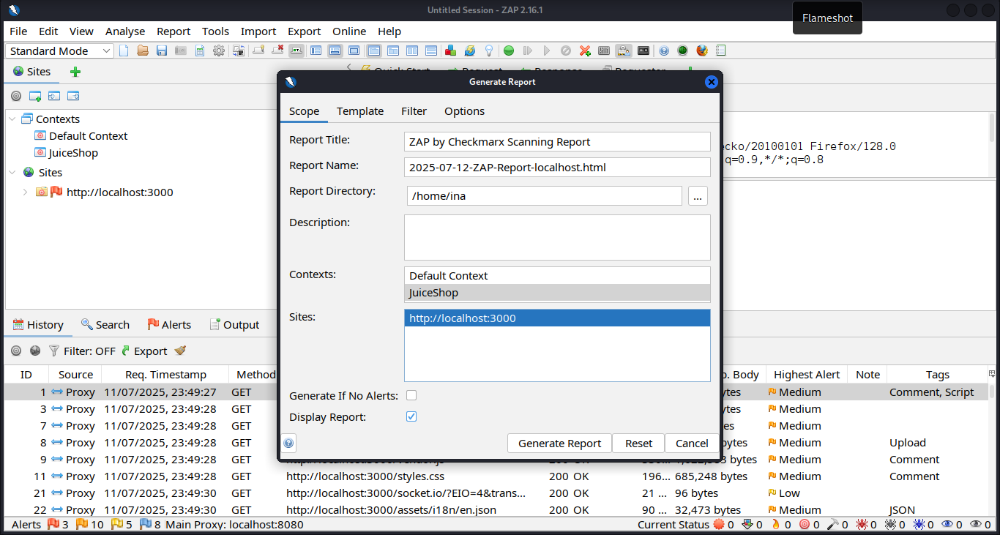

---

## Vulnerability Exploitation - Open Redirect

**Vulnerability Description:** Open Redirect vulnerabilities occur when a web application redirects a user to a URL specified by a user-controlled input without proper validation. This can be exploited to phish users or bypass security measures by redirecting them to malicious sites.

### Vulnerability Identification (Manual):
From the ZAP report, an "Open Redirect" vulnerability was highlighted. To understand its context, I manually navigated the Juice Shop application in a Firefox browser. Using the Developer Tools (Inspector tab), I examined the `href` attributes of various links, looking for parameters that might control redirects.

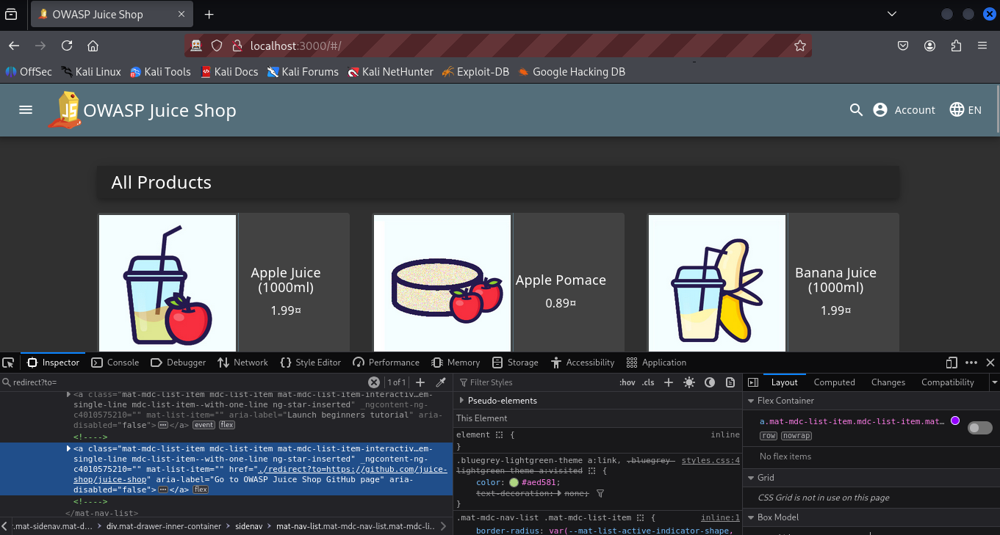

### Targeting the GitHub Logo:
I identified that the GitHub logo, when clicked, redirected to the official Juice Shop GitHub repository. This redirection mechanism was flagged by ZAP as potentially vulnerable.

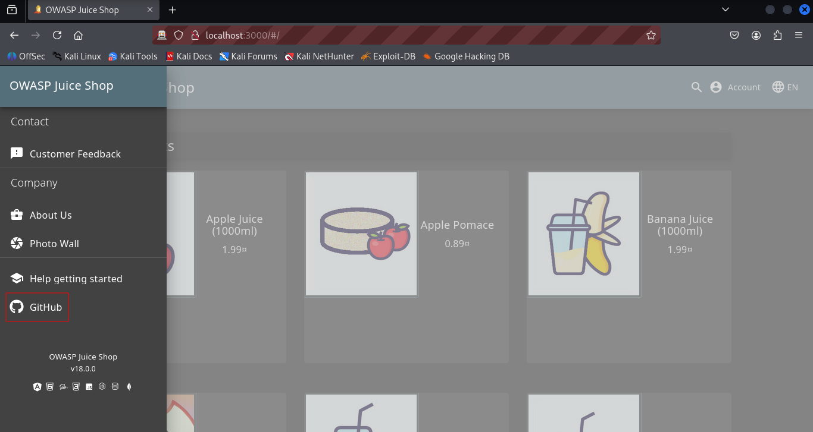

### Code Analysis (main.js):
To further investigate the redirection logic, I reviewed the `main.js` JavaScript file within the Developer Tools. This revealed the code responsible for handling the redirect to GitHub, confirming the presence of a redirection function.

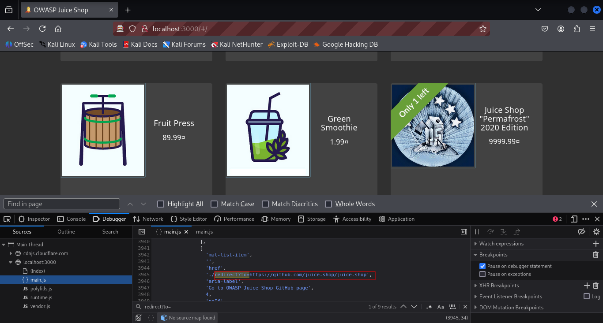

### Whitelist Observation:
During my analysis, I observed other redirect mechanisms within the application, suggesting the presence of an internal whitelist for allowed redirection targets. This indicated that a simple redirect to an arbitrary external URL might be blocked.

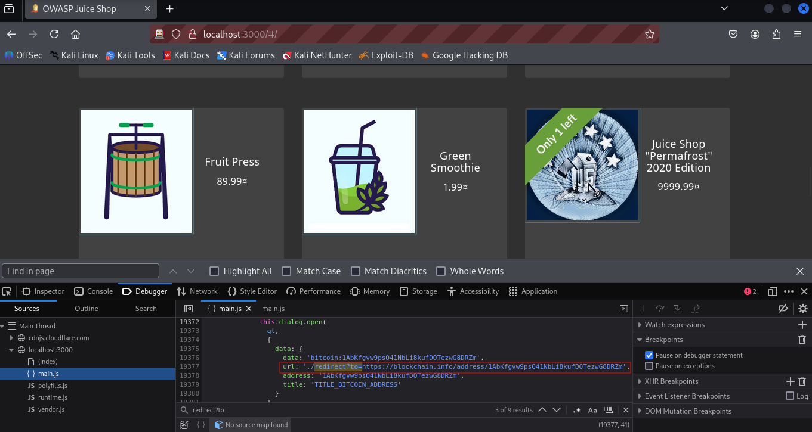

### Open Redirect Discovery:
I clicked on the GitHub logo within the Juice Shop application. This action successfully redirected me to the official OWASP Juice Shop GitHub page. **The URL for this redirection was subsequently identified by OWASP ZAP as having an open redirect vulnerability during its analysis.**

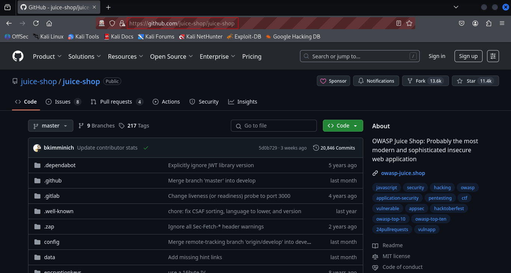

### ZAP Validation:
In **ZAP's HTTP History tab**, I then identified the specific GET request that was made when clicking the GitHub logo. This request clearly showed the parameters being used for the redirect, confirming how the vulnerability could be leveraged.

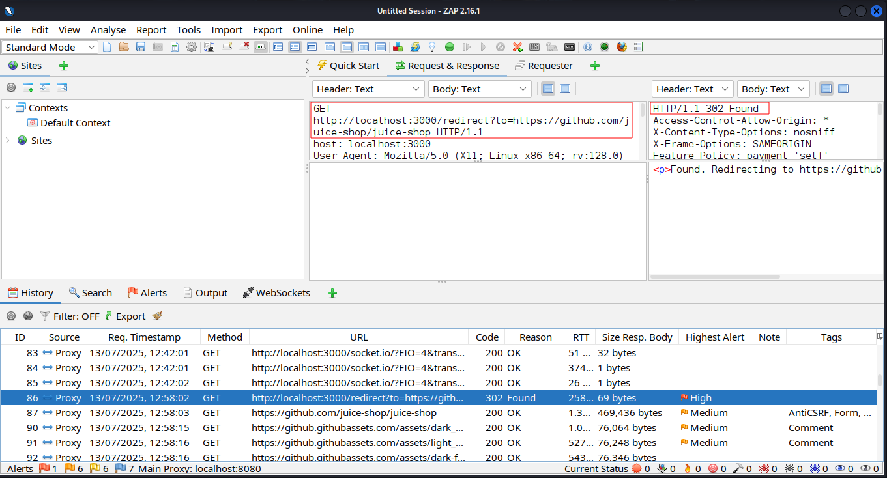

### Initial Attempt - Direct Redirect (Blocked):
I attempted to redirect to `www.google.com` by modifying the URL directly in the browser with the payload `/redirect?to=https://www.google.com`. As anticipated, the application returned a "406 Not Acceptable" error, confirming the whitelist or validation mechanism.

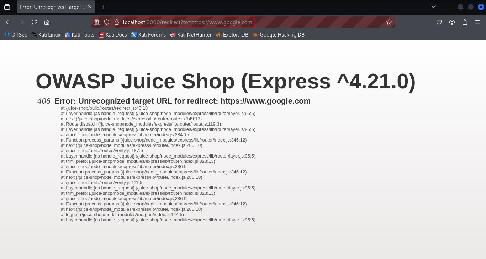

### Analyzing Request in ZAP History:
To understand why the redirect failed, I examined the corresponding GET request in ZAP's HTTP History. This allowed me to see the exact request sent to the server and the server's response, including the HTTP status code and any error messages. This confirmed the application's rejection of the unwhitelisted URL.

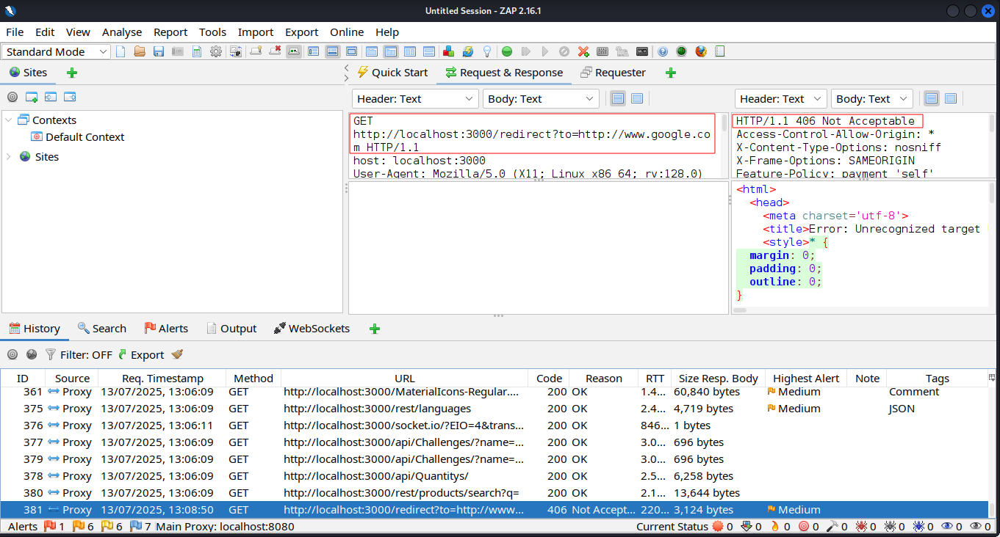

### Bypassing the Whitelist with a Malicious Payload:
To circumvent the apparent whitelist, I constructed a more sophisticated payload: `/redirect?to=https://www.google.com/?pwned=https://github.com/juice-shop/juice-shop`. This payload aimed to trick the application by appending a whitelisted URL (`https://github.com/juice-shop/juice-shop`) as a parameter to my desired malicious URL (`https://www.google.com`). This technique often works when the application performs a substring check for whitelisted domains. Upon entering this URL, I was successfully redirected to google.com, demonstrating a successful bypass of the open redirect protection.

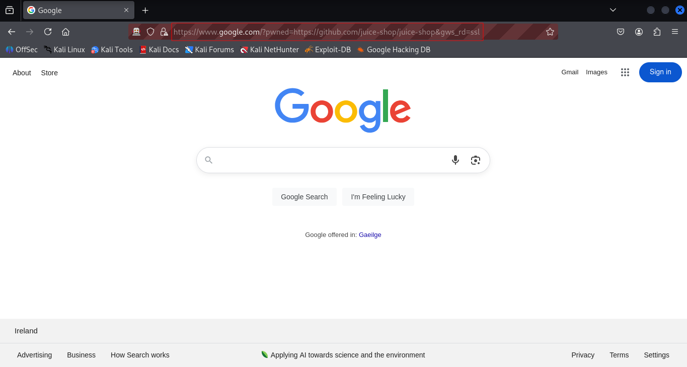

### Verifying Exploitation in ZAP History:
I located the successful redirection request in ZAP's HTTP History, confirming that the application processed my malicious payload and performed the redirect.

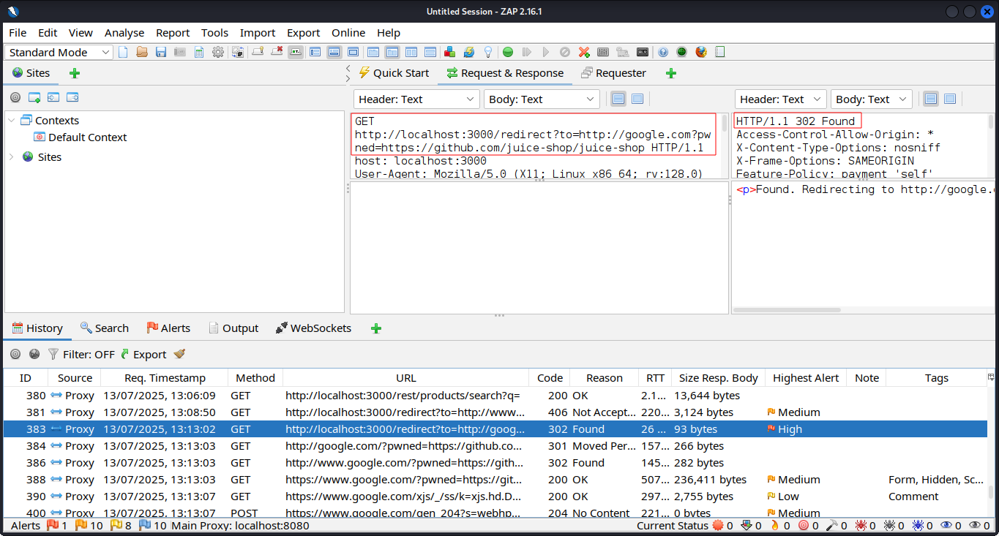

### Cleanup:
After demonstrating the exploitation, I shut down the Juice Shop Docker container.
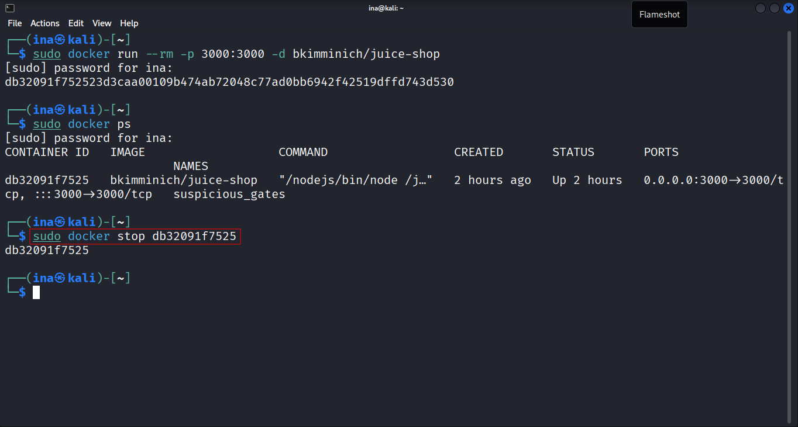

